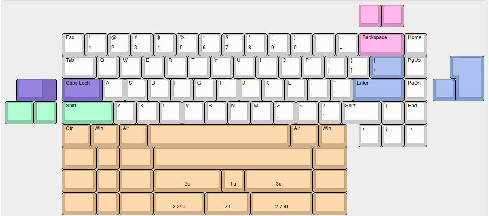

# RPNeko65

An open source multi-layout PCB for the [Bakeneko65](https://github.com/kkatano/bakeneko-65)

## Features
- QMK/VIA
- RGB LED under Caps Lock (currently non-functional without modification)
- Large amount of layout support
- C3 Unified Daughterboard
- Support for clip-in stabilizers

## Layout support

## Release history
- Rev 1: Initial prototype. Caps Lock LED is non-functional due to incorrect capacitor wiring, can be fixed by removing the capacitor and bridging the two pads

## Credits
- kkatano for creating the original Bakeneko65
- Zykrah for their [firmware script](https://github.com/zykrah/firmware-scripts)
- MarvFPV and ebastler for [marbastlib](https://github.com/ebastler/marbastlib)
- Sleepdealer for their [RP2040 design guide](https://github.com/Sleepdealr/RP2040-designguide)
- People in the Keyboard Atelier server for the help and assistance
